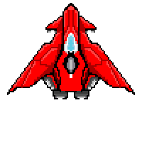

# Auriga 2D Shooter Game

  
  
  
  
  

A small 2D shooter game built with DirectX9
Inspired on a a scratch I made a long time ago [Auriga_Scratch](https://scratch.mit.edu/projects/693267247/)

Shoot Asteroids and survive

---

## 🎮 Features
- Simple WinAPI window
- Featuring menus and dialog boxes
- Sprite rendering
- Collision handling

---

### Toolbox

  
  

