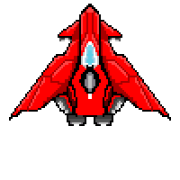

# 📝 Development Log

Welcome to my journey! This project starts as a way for me to apply what I've learned in directX and WinAPI. 

---

## 📅 2025-08-16
### ✅ Achievements

- Created the Readme for the repository! I wanted to make it pop a bit so I added a GIF and some images. 
I'm really happy to see how it ended up.

- Adding a Debug console to my empty project, since it has subsystem Windows it would normally not have a console. 

### 🔧 Notes
- Why is so hard to align thigns on a webpage? I'm glad to not be studying webdev...

  

